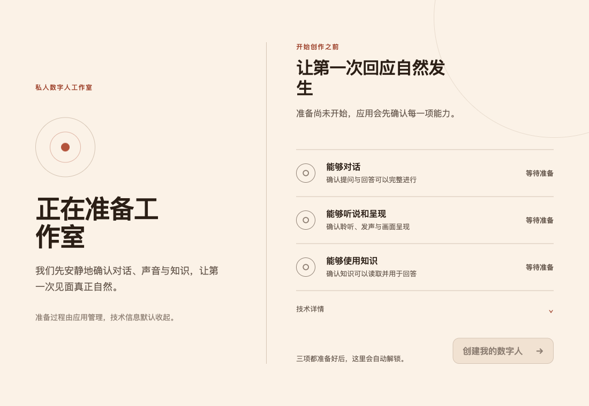
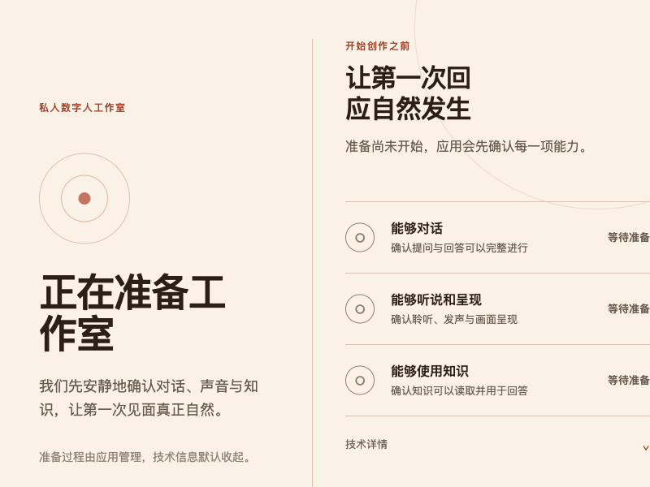

# VoxStudio（元人 / Meta-Human）

<p align="center">
  <strong>塑造你的数字人，与它自然对话</strong>
</p>

<p align="center">
  
</p>

VoxStudio 是一款 **macOS 优先** 的桌面应用，帮助用户塑造并对话自己的「数字人」。
应用基于 **Tauri 2 + React/TypeScript** 前端，配合一个 **Python 3.12 FastAPI sidecar**
提供真实能力校验、知识检索与对话服务。

产品当前切片实现了一个「**准备门禁（readiness gate）**」：在解锁数字人创建前，
`能够对话`、`能够听说和呈现`、`能够使用知识` 三项能力必须全部通过真实校验。

---

## 目录

- [主要特性](#主要特性)
- [项目截图](#项目截图)
- [技术栈](#技术栈)
- [仓库结构](#仓库结构)
- [安装步骤](#安装步骤)
- [配置要求](#配置要求)
- [使用说明](#使用说明)
- [校验与测试](#校验与测试)
- [构建发布](#构建发布)
- [常见问题解答](#常见问题解答)
- [贡献指南](#贡献指南)
- [文档索引](#文档索引)

---

## 主要特性

| 特性 | 说明 |
| --- | --- |
| **准备门禁（Readiness Gate）** | 三项能力必须全部通过真实校验才能创建数字人：对话能力、听说呈现能力、知识检索能力 |
| **本地模型支持** | 接入 OpenAI 兼容的本地推理服务（如 Ollama），提供对话、嵌入、语音识别 |
| **远程 GPU 服务** | 支持远程 GPU 提供者完成声音克隆、数字人形象流渲染、TTS 合成 |
| **飞书知识同步** | 通过飞书开放平台拉取 Wiki / Docx 文档，建立可引用的知识库 |
| **多轮对话** | 支持文本和语音提问，回复附带来源引用（grounded citation），含长期记忆摘要 |
| **媒体采集** | 支持摄像头拍照、麦克风录音，或从文件选择照片和录音作为数字人素材 |
| **安全隔离** | Sidecar 仅监听回环地址，每次启动随机生成 bearer token，密钥存入 macOS Keychain |
| **macOS 原生体验** | Tauri 2 原生窗口、系统通知、Keychain 集成、相机/麦克风权限管理 |

---

## 项目截图

### 准备工作室（Readiness Gate）

应用启动后进入「准备工作室」，展示三项能力的就绪状态。所有能力通过后，「创建我的数字人」按钮自动解锁。

<p align="center">
  
</p>

<p align="center">
  
</p>

> 更多分辨率截图见 `docs/screenshots/` 目录。

---

## 技术栈

| 层 | 技术 | 版本 |
| --- | --- | --- |
| 桌面壳 | **Tauri 2**（Rust） | 2.11.x |
| 前端 UI | **React 19** + TypeScript + Vite | React 19.2, TS 7.0, Vite 8.2 |
| 后端 Sidecar | **Python 3.12** + FastAPI + aiosqlite | Python ≥3.12,<3.13 |
| 打包工具 | **Nuitka**（sidecar 自包含二进制）、**Tauri bundle**（DMG） | — |
| 包管理器 | **pnpm**（前端 monorepo）、**uv**（Python 环境） | pnpm 11, uv latest |
| 测试框架 | **Vitest**（前端）、**pytest + pytest-asyncio**（sidecar）、**Playwright**（E2E） | — |

### 架构概览

```
┌─────────────────────────────────────────────┐
│              macOS Native Window             │
│  ┌──────────┐  ┌──────────────────────────┐ │
│  │  React   │  │    Rust Shell (Tauri)     │ │
│  │  Frontend│◄─┤  readiness contract      │ │
│  │ (Vite)   │  │  sidecar supervisor      │ │
│  └──────────┘  │  capture / media validate│ │
│                └──────────┬───────────────┘ │
│                           │ loopback + FD   │
│                ┌──────────▼───────────────┐ │
│                │  Python Sidecar (FastAPI) │ │
│                │  readiness / conversation │ │
│                │  knowledge / persistence  │ │
│                └──────────────────────────┘ │
└─────────────────────────────────────────────┘
```

- **Rust shell**：拥有原生生命周期管理和权威 readiness 契约。前端从不自行计算门禁状态。
- **Python sidecar**：运行真实有界能力校验，将可恢复进度持久化到 SQLite，暴露仅回环 API。
- **通信方式**：Rust supervisor 绑定回环 socket，将文件描述符传递给 sidecar；等待 `/healthz` 后视为就绪。

---

## 仓库结构

```text
apps/
  desktop/                    Tauri 2 + React + TypeScript 前端（含 Rust shell）
    src/                      React/TS 前端源码（组件、hooks、状态管理）
    src-tauri/                Rust shell：readiness 契约、sidecar 监管、媒体校验
      binaries/               Nuitka 打包后的 sidecar 二进制（按 host triple 命名）
      icons/                  应用图标（各尺寸 + iOS / Android）
    dist/                     前端构建产物（不入库）
  sidecar/                    Python FastAPI sidecar
    src/voxstudio_core/       API 路由、readiness 服务、持久化、安全
    tests/                    pytest 单元测试 + 集成测试
docs/
  development.md              完整开发指南（环境、架构、配置、排障）
  release-checklists.md       签名 DMG 发布清单
  real-provider-acceptance.md 真实 provider 验收流程
  plans/                     TDD 实现计划（按日期归档）
  screenshots/               项目界面截图
scripts/                     构建 / 冒烟测试 / 发布脚本（详见 scripts/README.md）
output/                      构建产物与冒烟测试报告（*.dmg 等大文件不入库）
```

---

## 安装步骤

### 1. 克隆仓库

```bash
git clone git@github.com:qq547820639/Meta-Human.git
cd Meta-Human
```

### 2. 安装先决条件

确保你的开发环境满足以下条件：

```bash
# 检查操作系统架构（需要 Apple Silicon）
uname -m
# 期望输出: arm64

# 检查 Node.js 版本
node --version
# 需要: >= 18

# 检查 pnpm 版本
pnpm --version
# 需要: >= 11（项目指定 pnpm@11.9.0）

# 检查 Rust 工具链
rustc --print version
cargo fmt --version
cargo clippy --version

# 检查 uv（Python 包管理器）
uv --version
```

> **提示**：如果尚未安装某些工具：
> - **Node.js + pnpm**：通过 [nvm](https://github.com/nvm-sh/nvm) 或 [fnm](https://github.com/Schniz/fnm) 安装 Node.js，然后 `corepack enable && corepack prepare pnpm@11.9.0 --activate`
> - **Rust**：通过 [rustup](https://rustup.rs/) 安装：`rustup component add rustfmt clippy`
> - **uv**：通过 `curl -LsSf https://astral.sh/uv/install.sh | sh` 安装

### 3. 安装依赖并构建 sidecar

```bash
# 安装前端 monorepo 所有依赖
pnpm install

# 同步 Python sidecar 的虚拟环境与依赖
uv sync --project apps/sidecar

# 用 Nuitka 将 sidecar 打包为自包含二进制
# 产物写入: apps/desktop/src-tauri/binaries/digital-human-sidecar-aarch64-apple-darwin
scripts/build-sidecar.sh
```

> **为什么需要 Nuitka？**
> Nuitka 将 Python sidecar 编译为独立的原生可执行文件，最终用户无需安装 Python 或任何依赖即可运行应用。

### 4. 启动开发模式

```bash
pnpm --dir apps/desktop tauri dev
```

此命令会同时启动：

1. **Vite 开发服务器** → `http://127.0.0.1:1420`（前端热更新）
2. **Rust shell 编译** → Tauri 原生窗口
3. **Sidecar 进程** → Python FastAPI 回环服务

启动成功后会打开 VoxStudio 原生窗口，显示「准备工作室」界面。

---

## 配置要求

### 开发环境最低要求

| 项目 | 要求 |
| --- | --- |
| 操作系统 | macOS on Apple Silicon（`aarch64-apple-darwin`） |
| Node.js | >= 18 |
| pnpm | 11.9.0（见根目录 `package.json` 的 `packageManager` 字段） |
| Rust | stable（需安装 `rustfmt` 和 `clippy` component） |
| Python | 3.12（由 uv 自动管理） |
| 磁盘空间 | 至少 15GB（Rust 编译 `src-tauri/target` 约 12GB） |

### 运行时环境变量

应用在启动时会读取以下环境变量来连接外部服务。你可以通过以下任一方式设置：

- **方式 A**：在应用内「设置」页面填写并保存（推荐）
- **方式 B**：启动前设置环境变量

#### 本地模型（OpenAI 兼容服务，如 Ollama）

| 变量 | 必填 | 说明 | 示例 |
| --- | --- | --- | --- |
| `VOXSTUDIO_LOCAL_BASE_URL` | 是 | OpenAI 兼容服务的地址 | `http://127.0.0.1:11434` |
| `VOXSTUDIO_LOCAL_CHAT_MODEL` | 是 | 对话模型名称 | `qwen2.5:7b` |
| `VOXSTUDIO_LOCAL_EMBEDDING_MODEL` | 是 | 嵌入模型名称 | `bge-m3:latest` |
| `VOXSTUDIO_LOCAL_STT_MODEL` | 否 | 语音识别模型名称 | `whisper-small` |
| `VOXSTUDIO_LOCAL_TIMEOUT_SECONDS` | 否 | 请求超时秒数 | `30` |
| `VOXSTUDIO_LOCAL_ALLOW_REMOTE` | 否 | 允许非回环地址（默认禁止） | `1` |

#### 远程 GPU 服务（声音/形象/TTS）

| 变量 | 必填 | 说明 | 示例 |
| --- | --- | --- | --- |
| `VOXSTUDIO_REMOTE_BASE_URL` | 是 | 远程 GPU 服务地址 | `https://gpu.example.com` |
| `VOXSTUDIO_REMOTE_API_KEY` | 是 | API 密钥 | `<your-api-key>` |
| `VOXSTUDIO_REMOTE_TTS_VOICE` | 是 | TTS 音色 ID | `sample-voice` |
| `VOXSTUDIO_REMOTE_VOICE_ENROLL_PATH` | 否 | 声音注册路径 | `/api/voice/enroll` |
| `VOXSTUDIO_REMOTE_AVATAR_ENROLL_PATH` | 否 | 形象注册路径 | `/api/avatar/enroll` |
| `VOXSTUDIO_REMOTE_AVATAR_STREAM_PATH` | 否 | 形象流路径 | `/api/avatar/stream` |
| `VOXSTUDIO_REMOTE_TTS_PATH` | 否 | TTS 合成路径 | `/api/tts/synthesize` |

#### 飞书知识库

| 变量 | 必填 | 说明 | 示例 |
| --- | --- | --- | --- |
| `VOXSTUDIO_FEISHU_ACCESS_TOKEN` | 是 | 用户访问令牌 | `<user-token>` |
| `VOXSTUDIO_FEISHU_SPACE_ID` | 是 | 知识空间 ID | `<space-id>` |
| `VOXSTUDIO_FEISHU_APP_ID` | 否 | 飞书应用 ID | `<app-id>` |
| `VOXSTUDIO_FEISHU_APP_SECRET` | 否 | 飞书应用密钥 | `<app-secret>` |
| `VOXSTUDIO_FEISHU_BASE_URL` | 否 | 飞书 API 地址（默认官方） | `https://open.feishu.cn` |

#### Apple 发布签名（仅构建 DMG 时需要）

| 变量 | 说明 |
| --- | --- |
| `VOXSTUDIO_SIGNING_IDENTITY` | Developer ID Application 签名身份 |
| `APPLE_TEAM_ID` | Apple 团队 ID |
| `APPLE_NOTARY_API_KEY` | 公证 API Key |
| `APPLE_NOTARY_KEY_ID` | 公证 Key ID |
| `APPLE_NOTARY_ISSUER` | 公证 Issuer ID |

---

## 使用说明

### 从零开始：完整用户旅程

#### 第一步：启动应用

开发模式下执行：

```bash
pnpm --dir apps/desktop tauri dev
```

或直接打开已构建的 DMG 安装包中的 VoxStudio 应用。

#### 第二步：进入准备工作室

应用启动后显示「准备工作室」界面，右侧列出三项待校验的能力：

1. **能够对话** — 确认提问与回答可以完整进行
2. **能够听说和呈现** — 确认聆听、发声与画面呈现
3. **能够使用知识** — 确认知识可以读取并用于回答

每项能力下方显示当前状态（`等待准备` / `action_required` / `ready`）。底部实时显示 `准备进度：x/3`。

#### 第三步：配置服务

点击右上角或 readiness 卡片上的 **`去设置`** 按钮，打开设置页面：

**本地模型配置：**
- 填写本地服务地址（如 `http://127.0.0.1:11434`，即 Ollama 默认地址）
- 填写对话模型、嵌入模型、语音识别模型名称
- 点击 **`测试本地连接`** 确认可达性

**远程 GPU 配置：**
- 填写远程 GPU 服务地址、API Key、TTS 音色
- 可选配置自定义端点路径（展开 `高级远程配置`）
- 点击 **`测试远程连接`** 确认可达性

**飞书知识配置：**
- 填写 App ID、App Secret、知识空间 ID
- 点击 **`授权飞书`** 完成 OAuth 授权（会打开浏览器进行回调）
- 也支持手动输入授权码的方式

**一键检查：**
- 点击 **`一键检查连接`** 同时验证本地模型、远程 GPU、飞书三项配置状态

#### 第四步：保存设置并观察 readiness

点击 **`保存设置`** 按钮：
- 设置写入 `settings.json`（非敏感值）和 macOS Keychain（密钥/token）
- Sidecar 自动重启，readiness 门禁重新运行
- 返回准备工作室，观察各项能力状态变化

当三项全部变为 `ready`，**`创建我的数字人`** 按钮自动解锁。

#### 第五步：采集媒体素材

解锁创建后：

- **拍照**：点击 **`拍摄照片`** 调用摄像头拍摄 JPEG 照片（需授予相机权限）
- **选照片**：点击选择文件按钮，从系统选取一张图片（JPEG/PNG/HEIC，<20MB）
- **录音**：点击 **`录制声音`** 调用麦克风录制 WAV（需授予麦克风权限，>=200ms）
- **选录音**：从系统选取一个 WAV 文件（<25MB）

选中后立即预览：照片显示为圆形头像，录音显示为原生音频控件。

#### 第六步：创建数字人

确认媒体素材无误后，点击 **`创建我的数字人`**：
- 系统弹出确认弹窗，说明照片和录音将上传到远程 GPU 服务
- 创建过程经过 `validating → building → ready` 状态机
- 支持 **取消** 进行中的构建、失败后 **重试**、重新采集媒体
- 成功后获得 `voice_id` 和 `avatar_id`，**`开始对话`** 按钮出现

#### 第七步：与数字人对话

进入对话界面：

- **文字提问**：在底部输入框输入问题，按 Enter 发送（Shift+Enter 换行）
- **语音提问**：点击 **`语音提问`** 开始录音，再次点击停止，自动转写为文字
- **查看回复**：助手回复以卡片形式展示，附带本地时间标签
- **复制回答**：每条回复旁有 **`复制`** 按钮
- **重新生成**：最新一条回复支持 **`重新生成`**（删除旧回复并请求新的）
- **重试**：失败的回复支持 **`重试`**（保留原问题重新发送）
- **停止生成**：生成中可点击 **`停止生成`** 中止请求
- **清空对话**：点击 **`清空对话`** 并确认，清除本地和持久化的对话历史
- **复制全部**：对话头部操作可 **`复制全部`**，将完整对话以 `我 / 数字人` 格式复制到剪贴板

**知识引用：** 当回复基于飞书知识库时，显示 `grounded` 标记和可点击的来源链接。

**TTS 语音播报：** 当配置了远程 GPU 服务时，回复同时合成音频，前端渲染原生音频控件播放数字人的语音回复。

**形象呈现：** 对话中显示采集的照片作为数字人形象；若远程 provider 返回 avatar stream URL，则渲染实时视频流。

**长期记忆：** 经过一定轮次对话后，系统自动将近期对话压缩为摘要存入长期记忆，并在后续对话中注入上下文。可在设置页查看、编辑或清除长期记忆。

---

## 校验与测试

### 一键全量门禁

运行所有自动化检查（工具链 + 单测 + 构建 + lint）：

```bash
scripts/verify-foundation.sh
```

该脚本会在以下任一环节失败时终止：

```bash
# 1. Python 测试
uv run --project apps/sidecar pytest apps/sidecar/tests \
  --strict-markers --strict-config -q

# 2. 前端单元测试
pnpm --dir apps/desktop exec vitest run

# 3. TypeScript 类型检查
pnpm --dir apps/desktop exec tsc --noEmit

# 4. 前端构建
pnpm --dir apps/desktop build

# 5. Rust 代码格式检查
cargo fmt --manifest-path apps/desktop/src-tauri/Cargo.toml -- --check

# 6. Rust Clippy 静态分析
cargo clippy --manifest-path apps/desktop/src-tauri/Cargo.toml \
  --all-targets --all-features -- -D warnings

# 7. Rust 测试
cargo test --manifest-path apps/desktop/src-tauri/Cargo.toml
```

### 冒烟测试

```bash
# 用 mock provider 跑端到端冒烟（不依赖真实外部服务）
scripts/smoke-mock-provider.py

# 检查主机是否有摄像头和麦克风
scripts/smoke-capture.sh

# 查看哪些真实 provider 冒烟路径可用
scripts/smoke-providers.sh

# 对打包后的 DMG 做冒烟（挂载→启动→校验→退出）
scripts/smoke-dmg.sh
```

---

## 构建发布

### 构建通用二进制（arm64 + x86_64）

```bash
# 需要额外提供 x86_64 Python 3.12 和交叉编译工具链包装器
VOXSTUDIO_X86_PYTHON=/path/to/x86_64/python3.12 \
VOXSTUDIO_X86_TOOLCHAIN=/path/to/x86-tool-wrappers \
scripts/build-universal.sh
```

### 构建签名 DMG

```bash
# 需要已安装 Developer ID Application 证书和公证凭证
scripts/release-dmg.sh
```

该脚本会依次执行：全部测试 → 构建 sidecar → 构建 DMG → 签名 → 公证 → staple。

### 发布前检查

```bash
# 列出发布先决条件和缺失项
scripts/verify-release-readiness.sh

# 对照完整发布清单
# 见 docs/release-checklists.md
```

---

## 常见问题解答

### Q: `git push` 失败，提示连接超时？

**A:** 当前网络环境下 GitHub HTTPS（443 端口）可能不通。请使用 SSH 方式推送：

```bash
git remote set-url origin git@github.com:qq547820639/Meta-Human.git
git push origin main
```

仓库已预配 SSH 远程地址，通常无需手动修改。

### Q: `tauri dev` 启动时端口 1420 被占用？

**A:** 有其他 Vite 或 Tauri dev 进程正在运行。先结束它们：

```bash
lsof -ti :1420 | xargs kill -9
```

然后重新启动 `tauri dev`。注意 sidecar 使用的是动态分配的回环端口，不会与 1420 冲突。

### Q: sidecar 缺失或无法启动？

**A:** 重新构建 sidecar 二进制：

```bash
scripts/build-sidecar.sh
```

确认产物存在于 `apps/desktop/src-tauri/binaries/digital-human-sidecar-aarch64-apple-darwin`。

### Q: readiness 门禁一直显示 `action_required`？

**A:** 这表示对应的外部服务未配置或不可达。常见原因：

1. **本地模型未启动** — 确保 Ollama 或其他兼容服务已在 `VOXSTUDIO_LOCAL_BASE_URL` 运行
2. **远程 GPU 未配置** — 在设置页填写远程服务地址和 API Key
3. **飞书未授权** — 完成飞书 OAuth 授权流程
4. **模型名称错误** — 确保填写的模型名称与服务端实际可用的一致

点击 readiness 卡片上的 **`去设置`** 可快速跳转到设置页。

### Q: 如何清除所有数据从头开始？

**A:** 应用内提供两个层级的数据清理：

- **`清空本地数据`**：清除对话历史、长期记忆、所有已同步知识源、临时媒体文件（保留 provider 设置和 Keychain 密钥）
- **`重置全部设置`**：清除设置文件和所有 Keychain 密钥，然后原地重启 sidecar

两项操作都需要二次确认。

### Q: `src-tauri/target` 目录占用了大量磁盘空间？

**A:** 这是 Rust 编译产物（约 12GB），已被 `.gitignore` 忽略，不会进入仓库。如需释放空间：

```bash
rm -rf apps/desktop/src-tauri/target
```

下次 `tauri dev` 或 `tauri build` 会自动重新编译。

### Q: 如何仅构建前端而不启动 Tauri？

**A:**

```bash
pnpm --dir apps/desktop dev        # 仅 Vite 开发服务器
pnpm --dir apps/desktop build      # 仅 tsc + vite build
pnpm --dir apps/desktop test       # 仅 vitest
```

### Q: 非 Apple Silicon Mac 可以开发吗？

**A:** 当前项目针对 Apple Silicon（`aarch64-apple-darwin`）优化。Intel Mac 理论上可以编译运行，但：
- sidecar Nuitka 打包产物需要为 `x86_64-apple-darwin` 重新构建
- 通用二进制（universal）构建流程已支持双架构，见 `scripts/build-universal.sh`

---

## 贡献指南

我们欢迎贡献！以下是参与流程：

### 1. Fork 与克隆

```bash
# Fork 仓库后在本地克隆
git clone git@github.com:<your-username>/Meta-Human.git
cd Meta-Human
```

### 2. 分支策略

- `main` — 主分支，受保护
- 功能分支命名：`feat/<描述>`、`fix/<描述>`、`docs/<描述>`、`chore/<描述>`

### 3. 开发流程

```bash
# 1. 创建功能分支
git checkout -b feat/my-feature

# 2. 安装依赖并构建 sidecar（首次）
pnpm install
uv sync --project apps/sidecar
scripts/build-sidecar.sh

# 3. 开发
pnpm --dir apps/desktop tauri dev

# 4. 确保全量门禁通过
scripts/verify-foundation.sh

# 5. 提交（遵循 conventional commits）
git add .
git commit -m "feat: add my feature description"

# 6. 推送并创建 PR
git push origin feat/my-feature
```

### 4. 代码规范

- **Rust**：`cargo fmt` 格式化 + `cargo clippy -D warnings` 静态分析
- **TypeScript**：`tsc --noEmit` 类型检查
- **Python**：遵循 PEP 8，`pytest` 全部通过
- **提交信息**：使用 [Conventional Commits](https://www.conventionalcommits.org/) 格式

### 5. PR 要求

- [ ] `scripts/verify-foundation.sh` 全量通过
- [ ] 无新增 lint 警告或错误
- [ ] 新功能需更新 `docs/plans/` 下的实现计划
- [ ] 涉及 UI 变更建议附截图

---

## 文档索引

| 文档 | 说明 |
| --- | --- |
| [development.md](docs/development.md) | 完整开发指南：环境搭建、架构细节、全部配置项、安全边界、排障手册 |
| [release-checklists.md](docs/release-checklists.md) | 签名 DMG 发布清单：先决条件、构建门禁、签名、公证、全新安装冒烟 |
| [real-provider-acceptance.md](docs/real-provider-acceptance.md) | 真实 provider 验收流程与证据清单 |
| [docs/README.md](docs/README.md) | 文档目录索引与阅读建议 |
| [scripts/README.md](scripts/README.md) | 全部构建/测试/发布脚本的分类说明 |
| [apps/desktop/README.md](apps/desktop/README.md) | 桌面前端子包说明 |
| [apps/sidecar/README.md](apps/sidecar/README.md) | Python sidecar 子包说明 |
| [docs/plans/](docs/plans/) | TDD 实现计划（按日期归档，共 7 份） |

---

## 许可

详见仓库 LICENSE 文件（待补充）。
